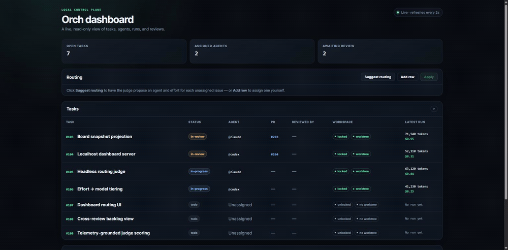

# harness_orchestrator (`orch`)

Run **Claude Code** and **Codex** as parallel coding agents on the same repo — safely.

Worktree-isolated parallel agents are commodity in 2026 (Claude Squad, Parallel
Code, Vibe Kanban, swarm-protocol, …). `orch` is built around the two things those
tools *don't* do:

1. **Mandatory cross-*model* review before merge** — the gate requires the PR's
   author label and `reviewed-by:<agent>` label to name different configured
   harnesses. Each dispatcher supplies only its own identity, so this reliably
   prevents accidental same-label self-review. The `--agent` value is not
   authenticated, however, so this is a process guarantee rather than proof of
   caller identity.
2. **Shared project memory across harnesses** — one canonical `AGENTS.md`; `CLAUDE.md`
   is a `@AGENTS.md` redirect, so both agents read (and write) the same brain.

On top of that it provides the commodity plumbing done cleanly: an **atomic
task-claim** (a `git` ref used as a distributed mutex), **one git worktree per
task**, a GitHub-Issues board, and an **`orch run` dispatcher** that launches each
harness headless per ticket.

## See it in action

`orch serve --demo` boots the dashboard against a seeded in-memory board — **no GitHub,
git, or agent CLIs required** — so you can drive the judge's **Suggest → edit → Apply**
routing loop in your browser. Walkthrough + screenshots: **[demo.md](demo.md)**.

```bash
npm install && npm run build
node dist/cli.js serve --demo    # open http://127.0.0.1:4000
```

[](demo.md)

## Requirements

- Node.js ≥ 20, git ≥ 2.15 (worktrees)
- [GitHub CLI](https://cli.github.com/) (`gh`), authenticated — the board + PRs run through it
- `claude` and `codex` on PATH (for the agent adapters)

## Quickstart

```bash
npm install && npm run build
npm link                       # puts `orch` on your PATH (or use `node dist/cli.js`)

cd ../my-project               # a GitHub repo
orch init                      # config + AGENTS.md/CLAUDE.md redirect + labels
orch doctor                    # verify git, gh auth, worktrees, adapters, labels
```

## The loop

```bash
orch plan tickets.json                 # lead: JSON tickets -> issues (deps + file hints)
orch assign                            # emit whole-graph routing brief + telemetry
orch assign --apply assignments.json   # fill blank agent + effort labels from a lead's plan
orch assign --round-robin              # legacy eligible-issue round-robin assignment

# run the two dispatchers concurrently — one per terminal:
#   terminal 1:  orch run --agent claude
#   terminal 2:  orch run --agent codex
# on Windows PowerShell, launch both from one shell with Start-Process:
#   Start-Process orch 'run --agent claude'; Start-Process orch 'run --agent codex'
# (POSIX `orch run --agent claude & orch run --agent codex &` backgrounds on bash,
#  but `&` does NOT background in PowerShell/cmd — the two would run sequentially)

# each daemon, per task:
#   claim (atomic) -> worktree -> spawn harness headless -> submit (PR + route review)
#
# then, cross-review:
orch review-queue --agent codex        # PRs awaiting codex
orch review-approve <pr> --agent codex # satisfies the gate for a claude-authored PR
orch merge <pr>                        # only if: green CI + approved by the OTHER harness
```

You watch `orch board` / `orch status`, and either trust the gate or set
`requireHumanMerge` to sign off yourself.

For a live, read-only view in a browser, run `orch serve` and open
`http://127.0.0.1:4000`. Use `orch serve --port <n>` to choose another local
port. The dashboard is localhost-only and refreshes from the canonical snapshot
every two seconds.

## Command reference

| Command | Purpose |
|---|---|
| `orch init` / `orch doctor` | scaffold config + memory + labels / verify environment |
| `orch plan <file>` | create issues from a JSON tickets file (deps + file-ownership) |
| `orch assign [--apply <file\|->] [--dry-run]` | emit a routing brief or fill blank agent + effort labels from a plan |
| `orch assign --round-robin` | legacy round-robin assignment for eligible issues |
| `orch next` / `orch claim <n>` | atomically claim a task, open its worktree |
| `orch brief <n>` | print the task briefing (spec + memory pointer + loop) |
| `orch submit <n>` | push branch, open PR (`Closes #n`), route cross-review |
| `orch run [--agent x] [--max n] [--once]` | dispatcher: claim + drive the harness |
| `orch review-queue` / `review <pr>` | list / inspect PRs awaiting your review |
| `orch review-approve <pr>` / `review-changes <pr>` | record cross-review outcome |
| `orch merge <pr>` / `orch integrate` | gated merge (one / all mergeable) |
| `orch board` / `orch status` | board view / your work + what's next |
| `orch serve [--port <n>] [--demo]` | live localhost dashboard (default port 4000); `--demo` serves a seeded board with no external deps |
| `orch memory add <text>` / `memory list` | shared memory (AGENTS.md log) |

Agent identity comes from `--agent`, `$ORCH_AGENT`, or `config.lead`.

## Configuration — `orch.config.json`

```json
{ "agents": ["claude","codex"], "lead": "claude",
  "requireCrossReview": true, "requireHumanMerge": false,
  "worktreeRoot": "../wt", "maxConcurrent": 2, "taskTimeoutMs": 1800000,
  "adapters": { "claude": {"cmd":"claude"}, "codex": {"cmd":"codex"} } }
```

## Design

- [docs/ARCHITECTURE.md](docs/ARCHITECTURE.md) — modules, the three load-bearing mechanisms, task lifecycle
- [docs/judge.md](docs/judge.md) — the routing judge: prompt contract, fail-closed parsing, and how it's evaluated
- [docs/adr/0001-build-vs-adopt.md](docs/adr/0001-build-vs-adopt.md) — prior-art survey + why build
- [docs/adr/0002-atomic-claim-via-git-ref.md](docs/adr/0002-atomic-claim-via-git-ref.md) — the claim mutex
- [docs/adr/0003-cross-review-is-a-process-guarantee.md](docs/adr/0003-cross-review-is-a-process-guarantee.md) — cross-review trust boundary + review backlog
- [docs/adr/0004-dashboard-write-surface.md](docs/adr/0004-dashboard-write-surface.md) — the dashboard's locality-trusted write surface
- [docs/adr/0005-judge-evaluation.md](docs/adr/0005-judge-evaluation.md) — how we evaluate the judge (validity now, quality by replay)

## Development

```bash
npm run dev -- <command>   # run from source (tsx)
npm run lint               # eslint (typescript-eslint, flat config)
npm run typecheck
npm test                   # atomic-claim concurrency, spawn plumbing, merge gate, judge validity
ORCH_JUDGE_LIVE=1 npm test # also runs the judge against a real model (needs `claude` on PATH)
```

CI runs `lint → typecheck → test → build` on Linux **and** Windows.

## License

MIT
