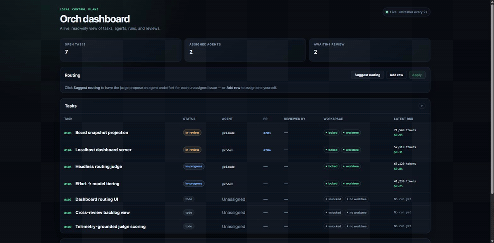
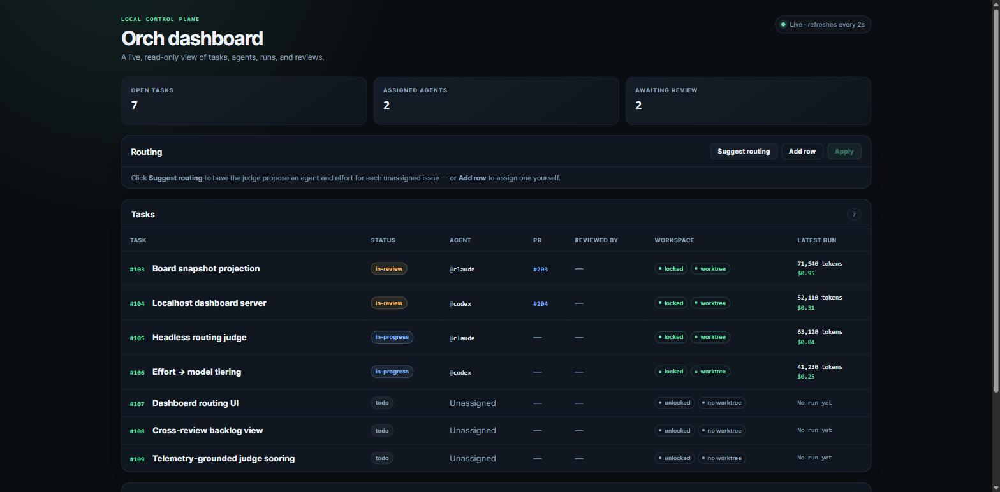
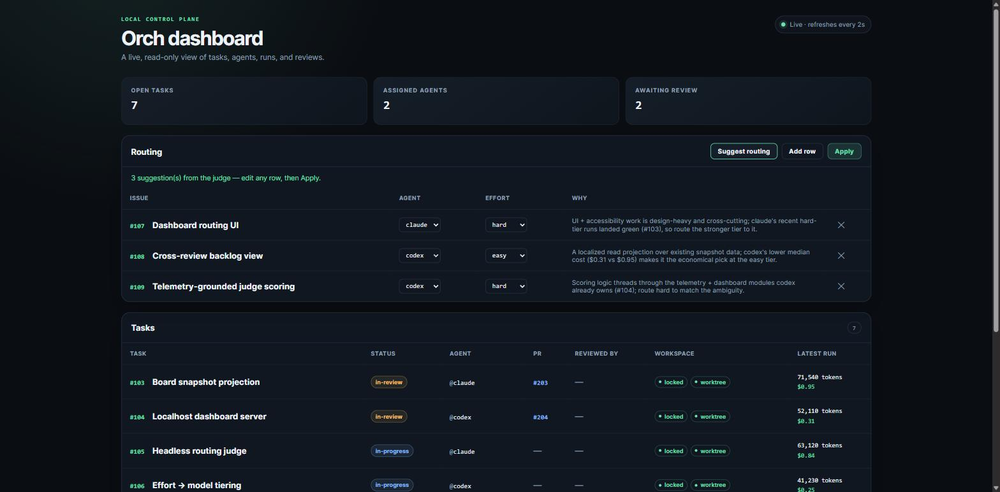
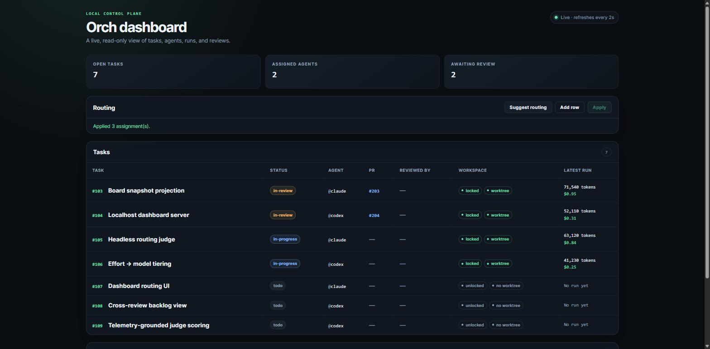
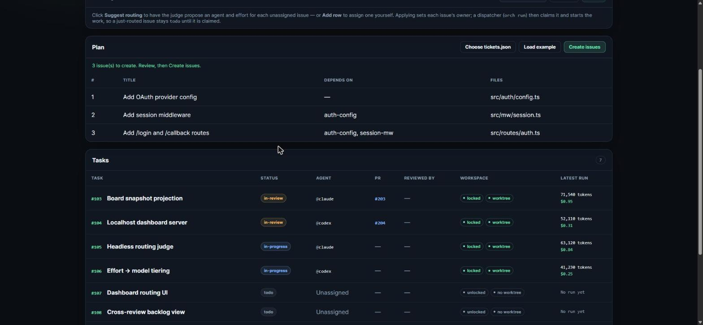
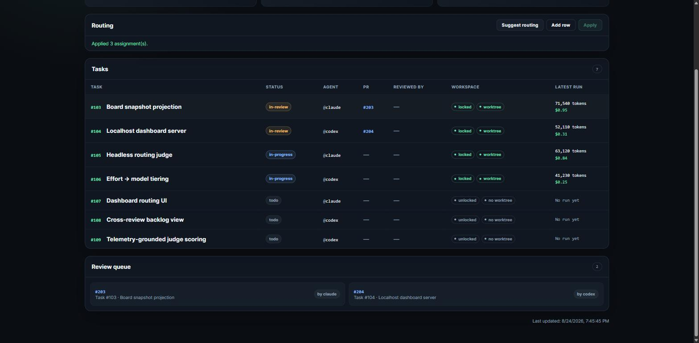

# Demo — the `orch` dashboard & routing judge

A two-minute tour of the live control plane: let the **routing judge** decide who
builds what, apply it, then dispatch a task and watch it advance into review.



_The whole loop above runs against the seeded `--demo` board — no GitHub, git, or agent CLIs. The four sections below break it down frame by frame._

## Run it yourself (no setup)

The demo is fully self-contained — **no GitHub, no git repo, no `claude`/`codex` on
PATH.** It swaps only the I/O boundary (GitHub/git/judge) for an in-memory board;
every HTTP route, the loopback guard, and the real `applyPlan` / `selectUnassigned`
routing logic run unchanged.

```bash
npm install && npm run build
node dist/cli.js serve --demo      # then open http://127.0.0.1:4000
```

---

## Scenario player and workflow graph

The workflow model in [`src/demo/flow-graph.ts`](src/demo/flow-graph.ts) describes
planning, routing, claiming, running, review, autopilot, recovery, and scheduling.
[`docs/FLOWS.md`](docs/FLOWS.md) renders the entire graph and each flow as Mermaid,
with summaries, ADR links, code references, and the scenarios that demonstrate it.
Regenerate it after changing the model or registry with `npm run docs:flows`.
`npm test` checks that scenarios visit every model edge and cover every flow,
and that the generated document matches the checked-in file.

Start the demo with the command above. `GET /flow` returns the graph in both normal
and demo mode. In demo mode, `GET /demo/scenarios` lists scenarios and the current
player frame. Load a scenario, move forward or backward, or reset the player through
`POST /actions/demo` with `{ "action": "load", "id": "<scenario-id>" }`,
`{ "action": "next" }`, `{ "action": "prev" }`, or `{ "action": "reset" }`.
For example, from the browser console at `http://127.0.0.1:4000`:

```js
const { scenarios } = await fetch('/demo/scenarios').then(r => r.json());
await fetch('/actions/demo', {
  method: 'POST',
  headers: { 'Content-Type': 'application/json', 'X-Orch-Request': 'dashboard' },
  body: JSON.stringify({ action: 'load', id: scenarios[0].id }),
}).then(r => r.json());
```

Each frame carries narration, its active graph node and incoming edge, the board,
and any real pure decider input/output. `/status` projects the loaded frame's board.
Scenario frames fake I/O and have no timers; their decisions call the production
pure functions. Reset returns the player and board to the fresh demo seed.

## 1. The live board

Open tasks projected from GitHub Issues + PRs + git worktrees + run telemetry, refreshed
every 2 s. Each row shows status, owning agent, its PR, cross-review state, whether the
task is **locked** (the atomic git-ref claim) and has a **worktree**, and the token/cost
of its latest run.



Here two agents are mid-flight: `claude` and `codex` each hold an in-progress task (locked,
worktree open) and each have a PR in review. Three issues (#107–#109) are still unrouted.

## 2. Suggest routing — the judge

Clicking **Suggest routing** runs the headless judge in-process. It reads a routing brief
(each unassigned issue's scope + dependencies + per-agent telemetry) and returns, for every
issue, **which agent** should build it and at **what effort tier** — each with a
one-sentence rationale grounded in the telemetry it used.



- **#107 Dashboard routing UI → `claude` / hard** — design-heavy, cross-cutting UI work.
- **#108 Cross-review backlog view → `codex` / easy** — a localized read projection; routed
  to the cheaper median-cost agent at the cheaper model tier.
- **#109 Telemetry-grounded judge scoring → `codex` / hard** — threads through modules codex
  already owns.

Effort is an **abstract, agent-neutral tier** (`easy` | `hard`); each adapter maps it to its
own model concept at spawn time (claude → `sonnet`/`opus`, codex → reasoning-effort
`low`/`high`). Every row is editable — the judge proposes, a human disposes.

## 3. Apply — write the plan back

**Apply** sends the (possibly hand-edited) plan to `POST /actions/assign`, which runs the
real `applyPlan` validator and writes `agent:` / `effort:` labels. Judge-authored rows are
additionally stamped `assigned-by:brain` for provenance; hand-edited rows are not. The board
updates live.



All three todos now carry an owner (`@claude` / `@codex`) and drop out of the unrouted set —
a second **Suggest** would return nothing to route.

Note they stay **`todo`**: routing only assigns an *owner*, never status. Click a row's
**Dispatch** button and confirm to start that task on demand. In normal mode the selected harness
is spawned in the background; in `--demo`, timers simulate the same visible
`claimed` → `in-progress` → `in-review` lifecycle without running an agent.

## 4. Plan — from a draft to issues

The **Plan** panel is the front of the lifecycle: turn a `tickets.json` into GitHub issues.
Draft one on the CLI with `orch plan --draft "<goal>"` (the LLM planner via the `orch-plan`
skill), then here **Choose tickets.json** — or **Load example** — to preview exactly what would
be created: each ticket's title, its resolved `dependsOn`, and its file-ownership hints,
validated by the same pure `resolvePlan` the CLI uses. Blocking errors (missing title, duplicate
id) disable **Create**; advisory warnings (a dropped dependency, two tickets claiming one file)
are shown but don't.



Nothing is written until you click **Create issues** and confirm. `POST /actions/plan-preview`
is read-only; `POST /actions/plan-create`, assign, and dispatch are the mutating routes behind
the same `isLoopback` guard. In `--demo` the new issues append to the in-memory board, so they
show up in **Tasks** as fresh `todo`s.

## 5. Cross-review queue

The merge gate is a **process guarantee**: a PR may merge only when its issue carries an
author label and a `reviewed-by:<agent>` label naming a *different* configured harness. The
review queue surfaces exactly the PRs awaiting that cross-model sign-off.



---

## What's real vs. faked in `--demo`

| Real (runs unchanged) | Faked (in-memory fixture) |
|---|---|
| Every HTTP route + the `isLoopback` write guard | GitHub Issues/PRs (`gh`) |
| `applyPlan` / `selectUnassigned` routing validation | git worktrees + the claim lock |
| The board snapshot → dashboard render path | the judge's LLM call (canned plan) |
| `Suggest → edit → Apply → Dispatch` HTTP round-trip | harness execution + timed lifecycle transitions |
| `resolvePlan` validation + the `Plan` preview → create round-trip | issue creation (`createIssues` appends in-memory) |

The fixture lives in [`src/server/demo.ts`](src/server/demo.ts) and is wired through the same `ServerDeps`
seam the tests use, so the demo exercises the production code paths rather than a mock-up.

## More

- [README](README.md) — the full loop and command reference
- [docs/ARCHITECTURE.md](docs/ARCHITECTURE.md) — the three load-bearing mechanisms
- [docs/adr/](docs/adr/) — build-vs-adopt, the atomic claim, the cross-review trust boundary,
  and the dashboard write surface
