# Workflow flows

<!-- Generated by scripts/gen-flows.ts. Edit the model and scenarios, then run npm run docs:flows. -->

Generated from [the flow model](../src/demo/flow-graph.ts) and [the scenario registry](../src/demo/scenarios/index.ts). The dashboard's `/flow` endpoint serves the same graph. Run `node dist/cli.js serve --demo` to explore scenario frames through `/demo/scenarios` and `/actions/demo`; see [the demo guide](../demo.md).

`npm test` requires scenarios to visit every model edge and demonstrate every flow, and checks this file for drift. Coverage describes the modeled transitions; scenarios fake I/O and record real pure decider calls.

## Overview

```mermaid
flowchart LR
  subgraph lane_plan["Plan"]
    n0["Goal + interactive plan"]
    n1{"Plan gate"}
    n2(["Print commands (hint)"])
    n3{"Resolve plan"}
    n4(["Blocked by plan errors"])
    n5{"Marker reuse?"}
    n6["Create issues"]
  end
  subgraph lane_route["Route"]
    n7["Routing brief"]
    n8["Lead judge"]
    n9["Evaluate plan (advisory)"]
    n10{"Apply (fill blanks)"}
    n11(["Left unrouted"])
    n12{"Eligible issues"}
    n13{"Dependency graph"}
    n14["After: ordering"]
    n15(["Deadlock reported"])
  end
  subgraph lane_run["Claim / run"]
    n16["ready"]
    n17["Claim next"]
    n18{"Claim saga"}
    n19["Compensate"]
    n20["claimed"]
    n21["in-progress"]
    n22{"Run outcome"}
    n23["Submit"]
    n24["Run failed"]
    n25["No commits"]
    n26{"Safe cleanup"}
    n27{"Usage limit?"}
    n28["Requeue"]
  end
  subgraph lane_review["Review"]
    n29["in-review"]
    n30{"Pick reviewer"}
    n31["Cross-review"]
    n32["Self-review"]
    n33["Reviewer verdict run"]
    n34{"Verdict"}
    n35["Record approval"]
    n36["Request changes"]
    n37(["Fail closed"])
    n38{"Merge gate"}
    n39["Merge"]
    n40["done"]
    n41{"Safe cleanup"}
  end
  subgraph lane_autopilot["Autopilot"]
    n42["Observe PRs"]
    n43{"Decide step"}
    n44(["none"])
    n45["review"]
    n46["fix"]
    n47["resolve-conflict"]
    n48["Push + requeue review"]
    n49["wait"]
    n50(["await-human"])
    n51["merge"]
    n52["triage"]
    n53["escalate"]
    n54(["Human handoff"])
    n55(["Run report"])
  end
  subgraph lane_recovery["Recovery"]
    n56["needs-attention"]
    n57["orch repair"]
    n58{"Project state"}
    n59["inconsistent"]
    n60["orch abandon"]
    n61{"Safe to remove?"}
    n62(["Retained + named"])
    n63["--discard"]
    n64{"Back to todo"}
  end
  n0 -->|"tickets.json written"| n3
  n3 -->|"errors block"| n4
  n3 -->|"valid (warnings advisory), previewed"| n1
  n1 -->|"no TTY, no --yes: hint"| n2
  n1 -->|"declined (n): hint"| n2
  n1 -->|"ask (y) or --yes: run"| n5
  n5 -->|"no marker: create"| n6
  n6 -->|"create error: re-list"| n5
  n5 -->|"marker found: reuse issue"| n7
  n6 -->|"created: route them"| n7
  n7 -->|"brief to the lead"| n8
  n8 -->|"routing plan JSON"| n9
  n9 -->|"advisory: gaps warn on stderr, never blocks"| n10
  n10 -->|"valid entries: agent:/effort: filled"| n16
  n10 -->|"invalid or missing entry: skipped"| n11
  n16 -->|"next / run / autopilot"| n12
  n12 -->|"open dependencies"| n13
  n13 -->|"cycle and none eligible"| n15
  n13 -->|"eligible set"| n14
  n14 -->|"lowest preference first"| n17
  n17 -->|"lock + projection + worktree"| n18
  n18 -->|"setup verified"| n20
  n18 -->|"step failed"| n19
  n19 -->|"verified: delta restored, own lock deleted"| n16
  n19 -->|"worktree usable and projection proven: roll forward"| n20
  n19 -->|"unverifiable: ownership retained"| n62
  n20 -->|"start-work"| n21
  n21 -->|"harness exits"| n22
  n22 -->|"commits made"| n23
  n23 -->|"PR opened"| n29
  n22 -->|"non-zero exit"| n24
  n22 -->|"no commits"| n25
  n24 -->|"safe cleanup"| n26
  n25 -->|"safe cleanup"| n26
  n26 -->|"worktree removed: failure telemetry"| n56
  n26 -->|"work retained + failure telemetry"| n59
  n22 -->|"own log shows a limit"| n27
  n27 -->|"no commits, no open PR, worktree removed, lock released"| n28
  n27 -->|"requeue guard failed: commits ahead, open PR, worktree retained or lock not released"| n24
  n28 -->|"status:todo, harness paused"| n16
  n28 -->|"autopilot: agent.unavailable"| n49
  n29 -->|"review:needed"| n30
  n30 -->|"other harness available"| n31
  n30 -->|"all others paused (cross-or-self)"| n32
  n31 -->|"read-only checkout of the head"| n33
  n32 -->|"fresh session, mode:self"| n33
  n33 -->|"reply parsed"| n34
  n34 -->|"approve"| n35
  n34 -->|"changes"| n36
  n34 -->|"unreadable or no diff"| n37
  n36 -->|"author bounce"| n21
  n37 -->|"nothing recorded"| n29
  n35 -->|"approval on current head"| n38
  n38 -->|"gate passes"| n39
  n38 -->|"stale head or no accepted approval"| n29
  n39 -->|"merged, lock released"| n41
  n41 -->|"worktree removed: resources released"| n40
  n41 -->|"worktree retained, lock released"| n59
  n29 -->|"autopilot polls open PRs"| n42
  n21 -->|"autopilot polls author bounce"| n42
  n42 -->|"observed facts"| n43
  n43 -->|"needs-attention or no PR"| n44
  n43 -->|"no accepted approval"| n45
  n45 -->|"runs the reviewer"| n30
  n43 -->|"changes requested"| n46
  n43 -->|"CI failing"| n46
  n46 -->|"agent fixed, orch pushes"| n48
  n43 -->|"branch conflicts with base"| n47
  n47 -->|"base merged, ancestor verified"| n48
  n48 -->|"review:needed restored"| n29
  n43 -->|"CI pending or mergeability unknown"| n49
  n49 -->|"poll again"| n42
  n43 -->|"approved and green"| n51
  n43 -->|"requireHumanMerge"| n50
  n50 -->|"human runs orch merge"| n38
  n51 -->|"always through the gate"| n38
  n43 -->|"budget spent, triages left"| n52
  n52 -->|"retry: guidance recorded, re-observe"| n42
  n52 -->|"escalate, paused, failed or unparseable"| n53
  n43 -->|"budget spent, no triage left (spent or off)"| n53
  n53 -->|"label + PR comment"| n54
  n54 -->|"loop ignores the task until handed back"| n44
  n43 -->|"drained or plan-complete"| n55
  n56 -->|"human runs orch repair"| n57
  n57 -->|"observe facts"| n58
  n58 -->|"converged: reset for retry"| n16
  n58 -->|"lock and worktree restored, no work yet"| n20
  n58 -->|"work ahead under the lock, or changes requested on the open PR"| n21
  n58 -->|"open PR: review projections restored"| n29
  n58 -->|"merged: issue closed, retained resources safely removed"| n40
  n58 -->|"closed PR or unresolved run: still a human's"| n56
  n58 -->|"invariant violated or work preserved"| n59
  n59 -->|"--apply one action, re-observe"| n57
  n56 -->|"orch abandon #60;n#62;"| n60
  n60 -->|"plain abandon: safe removal"| n61
  n61 -->|"clean: removed, lock released"| n64
  n61 -->|"dirty or untracked: retained"| n62
  n60 -->|"--discard (human explicit)"| n63
  n63 -->|"force removed, lock released"| n64
  n64 -->|"no failure telemetry, no commits ahead"| n16
  n64 -->|"failure telemetry remains or commits ahead"| n56
```

## Plan to issues

Interactive plan, the single human gate, validation, deterministic marker reuse and creation.

Design: [ADR-0010](adr/0010-lead-at-decision-points.md)

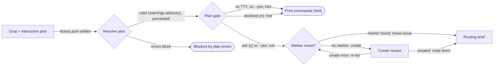

Code references:

- [src/tasks/planner.ts](../src/tasks/planner.ts) — `runInteractivePlanner`
- [src/commands/plan-pipeline.ts](../src/commands/plan-pipeline.ts) — `planGate`
- [src/tasks/plan.ts](../src/tasks/plan.ts) — `resolvePlan`
- [src/tasks/plan-create.ts](../src/tasks/plan-create.ts) — `createFromPlan`
- [src/commands/assign.ts](../src/commands/assign.ts) — `autoRoute`

Scenarios:

- **Plan gate: ask on a terminal** (`plan-gate-ask`): An interactive session on a TTY asks once; a yes starts the pipeline.
- **Plan gate: --yes** (`plan-gate-run`): --yes approves up front, so the gate lets the pipeline run without asking.
- **Plan gate: no terminal, no --yes** (`plan-gate-hint`): Without a TTY or --yes the gate only prints the commands to run.
- **Plan gate: declined** (`plan-gate-declined`): Answering no at the prompt prints the commands instead of starting anything.
- **Plan blocked by an error** (`plan-blocked`): A duplicate ticket id is a blocking error: validation stops before any approval or creation.
- **Plan with warnings, then create** (`plan-create`): Warnings (a dropped dependency, a shared file) are advisory; issues are created from the validated plan.
- **Idempotent re-run reuses issues** (`plan-rerun`): Deterministic plan and ticket markers let a repeated or resumed run reuse the issues it already created.
- **Reconcile a lost create response** (`plan-create-response-lost`): A create error triggers a fresh issue list; finding the deterministic marker prevents a duplicate.

## Routing

The lead judge routes unrouted issues; assign only fills blanks.

Design: [ADR-0005](adr/0005-judge-evaluation.md)

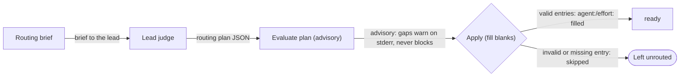

Code references:

- [src/commands/assign.ts](../src/commands/assign.ts) — `autoRoute`
- [src/routing/judge.ts](../src/routing/judge.ts) — `runJudge`
- [src/routing/judge-eval.ts](../src/routing/judge-eval.ts) — `evaluatePlan`
- [src/routing/assign.ts](../src/routing/assign.ts) — `applyPlan`
- [src/tasks/lifecycle.ts](../src/tasks/lifecycle.ts) — `deriveTaskState`

Scenarios:

- **Judge routes the backlog** (`routing-judge`): The lead judge returns a plan; valid entries fill in blank agent:/effort: labels.
- **Judge entry skipped** (`routing-skip`): An entry naming an unconfigured agent is skipped at write time; the issue stays unrouted.

## Claim and run

Eligibility, the atomic claim saga with compensation, and the processClaimed outcomes.

Design: [ADR-0002](adr/0002-atomic-claim-via-git-ref.md)

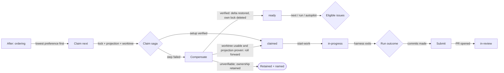

Code references:

- [src/board/board.ts](../src/board/board.ts) — `eligibleIssues`
- [src/board/board.ts](../src/board/board.ts) — `orderByAfter`
- [src/tasks/lifecycle.ts](../src/tasks/lifecycle.ts) — `deriveTaskState`
- [src/tasks/service.ts](../src/tasks/service.ts) — `claimNext`
- [src/tasks/service.ts](../src/tasks/service.ts) — `claimSpecific`
- [src/tasks/runner.ts](../src/tasks/runner.ts) — `processNext`
- [src/tasks/service.ts](../src/tasks/service.ts) — `submit`
- [src/git/worktree.ts](../src/git/worktree.ts) — `worktreeRemovalSafety`

Scenarios:

- **Claim, run, review, merge** (`happy-path`): One routed task flows from todo to done under the real deciders.
- **Ambiguous claim write: compensate** (`claim-compensation`): Re-observe ambiguous writes; compensate only the saga's own delta and owner token.
- **Ambiguous claim rolls forward** (`claim-roll-forward`): Claim setup re-observes durable facts before compensating or accepting an ambiguous write.
- **Claim compensation preserves ownership** (`claim-retain`): Claim setup re-observes durable facts before compensating or accepting an ambiguous write.

## Cross-review and merge

The other harness reviews the exact head; verdicts are head-bound and the merge gate is the only way in.

Design: [ADR-0003](adr/0003-cross-review-is-a-process-guarantee.md)

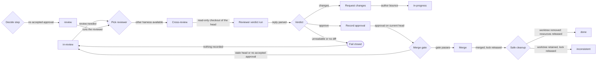

Code references:

- [src/tasks/lifecycle.ts](../src/tasks/lifecycle.ts) — `deriveTaskState`
- [src/board/reviewer.ts](../src/board/reviewer.ts) — `pickReviewer`
- [src/board/review-run.ts](../src/board/review-run.ts) — `runAutomatedReview`
- [src/board/review-run.ts](../src/board/review-run.ts) — `parseVerdict`
- [src/board/review.ts](../src/board/review.ts) — `approve`
- [src/board/review.ts](../src/board/review.ts) — `requestChanges`
- [src/board/review.ts](../src/board/review.ts) — `checkMergeGate`
- [src/board/review.ts](../src/board/review.ts) — `merge`
- [src/git/worktree.ts](../src/git/worktree.ts) — `worktreeRemovalSafety`
- [src/tasks/steps.ts](../src/tasks/steps.ts) — `decideStep`
- [src/tasks/lifecycle.ts](../src/tasks/lifecycle.ts) — `decideTaskTransition`

Scenarios:

- **Claim, run, review, merge** (`happy-path`): One routed task flows from todo to done under the real deciders.
- **Changes, resumed fix, re-review, merge** (`autopilot-review-fix`): The loop re-derives each step from observed facts and reviews every changed head before merging.
- **Fix failing CI** (`autopilot-ci-fix`): The loop re-derives each step from observed facts and reviews every changed head before merging.
- **Merge the base to resolve conflict** (`autopilot-conflict`): The loop re-derives each step from observed facts and reviews every changed head before merging.
- **Unreadable review fails closed** (`review-unreadable-verdict`): An unreadable reviewer response records no approval or change request.
- **Merge retains untracked work** (`merge-worktree-retained`): A successful merge releases the lock, but safe cleanup preserves untracked files.

## Autopilot loop

Observe, decide one step, execute, re-observe: review feedback, waiting, merge.

Design: [ADR-0009](adr/0009-autonomous-task-loop.md)

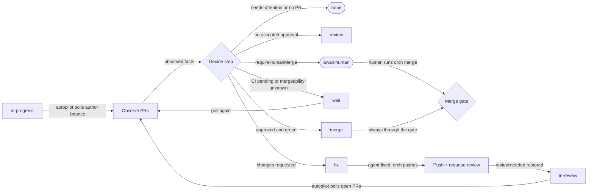

Code references:

- [src/tasks/lifecycle.ts](../src/tasks/lifecycle.ts) — `deriveTaskState`
- [src/board/review.ts](../src/board/review.ts) — `checkMergeGate`
- [src/tasks/observe.ts](../src/tasks/observe.ts) — `observeTasks`
- [src/tasks/steps.ts](../src/tasks/steps.ts) — `decideStep`
- [src/board/review-run.ts](../src/board/review-run.ts) — `runAutomatedReview`
- [src/tasks/step-exec.ts](../src/tasks/step-exec.ts) — `executeFix`
- [src/board/review.ts](../src/board/review.ts) — `merge`

Scenarios:

- **Changes, resumed fix, re-review, merge** (`autopilot-review-fix`): The loop re-derives each step from observed facts and reviews every changed head before merging.
- **Wait for CI** (`autopilot-wait-ci`): An approved head waits for external facts to settle.
- **Wait for mergeability** (`autopilot-wait-mergeability`): An approved head waits for external facts to settle.
- **Human merge required** (`autopilot-await-human`): An approved green PR waits for the configured human merge gate.
- **Ambiguous twin PRs** (`autopilot-ambiguous`): Twin PRs are reported and neither is driven.
- **Autopilot skips human-owned tasks** (`autopilot-human-owned`): needs-attention causes decideStep to drive no action.
- **Human opens the merge gate** (`human-runs-merge`): A human invokes orch merge after an approved green PR reaches await-human.

## CI fix

A failing check resumes the author's session for a fix round.

Design: [ADR-0009](adr/0009-autonomous-task-loop.md)

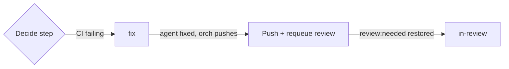

Code references:

- [src/tasks/lifecycle.ts](../src/tasks/lifecycle.ts) — `deriveTaskState`
- [src/tasks/steps.ts](../src/tasks/steps.ts) — `decideStep`
- [src/tasks/step-exec.ts](../src/tasks/step-exec.ts) — `executeFix`

Scenarios:

- **Fix failing CI** (`autopilot-ci-fix`): The loop re-derives each step from observed facts and reviews every changed head before merging.

## Conflict resolution

A branch that conflicts with base gets the base merged in, never rebased.

Design: [ADR-0009](adr/0009-autonomous-task-loop.md)

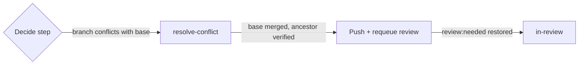

Code references:

- [src/tasks/lifecycle.ts](../src/tasks/lifecycle.ts) — `deriveTaskState`
- [src/tasks/steps.ts](../src/tasks/steps.ts) — `decideStep`
- [src/tasks/step-exec.ts](../src/tasks/step-exec.ts) — `executeResolveConflict`
- [src/tasks/step-exec.ts](../src/tasks/step-exec.ts) — `executeFix`

Scenarios:

- **Merge the base to resolve conflict** (`autopilot-conflict`): The loop re-derives each step from observed facts and reviews every changed head before merging.

## Lead triage

When the round budget is spent the lead decides retry or escalate.

Design: [ADR-0010](adr/0010-lead-at-decision-points.md)

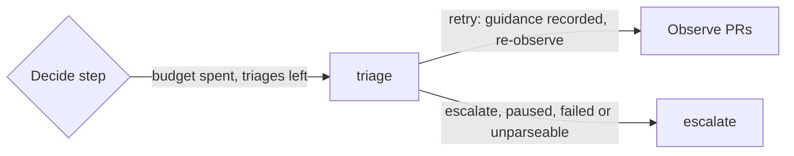

Code references:

- [src/tasks/observe.ts](../src/tasks/observe.ts) — `observeTasks`
- [src/tasks/steps.ts](../src/tasks/steps.ts) — `decideStep`
- [src/tasks/step-exec.ts](../src/tasks/step-exec.ts) — `executeTriage`
- [src/tasks/step-exec.ts](../src/tasks/step-exec.ts) — `executeEscalate`

Scenarios:

- **Lead grants a guided hard retry** (`autopilot-triage-retry`): Three spent fix rounds exhaust the budget; the lead may grant one guided round or hand off to a human.
- **Lead escalates** (`autopilot-triage-escalate`): Three spent fix rounds exhaust the budget; the lead may grant one guided round or hand off to a human.
- **Triage disabled** (`autopilot-triage-disabled`): Three spent fix rounds exhaust the budget; the lead may grant one guided round or hand off to a human.

## Escalation

A stuck task is labelled needs-attention with an explanatory comment.

Design: [ADR-0009](adr/0009-autonomous-task-loop.md)

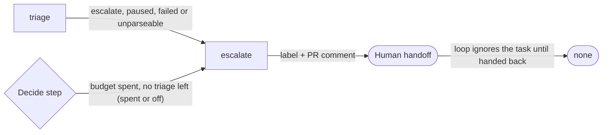

Code references:

- [src/tasks/steps.ts](../src/tasks/steps.ts) — `decideStep`
- [src/tasks/step-exec.ts](../src/tasks/step-exec.ts) — `executeTriage`
- [src/tasks/step-exec.ts](../src/tasks/step-exec.ts) — `executeEscalate`

Scenarios:

- **Lead grants a guided hard retry** (`autopilot-triage-retry`): Three spent fix rounds exhaust the budget; the lead may grant one guided round or hand off to a human.
- **Lead escalates** (`autopilot-triage-escalate`): Three spent fix rounds exhaust the budget; the lead may grant one guided round or hand off to a human.
- **Triage disabled** (`autopilot-triage-disabled`): Three spent fix rounds exhaust the budget; the lead may grant one guided round or hand off to a human.

## Usage limit

A run that hit a harness limit is requeued and the harness waited out, not failed.

Design: [ADR-0008](adr/0008-self-review-fallback.md)

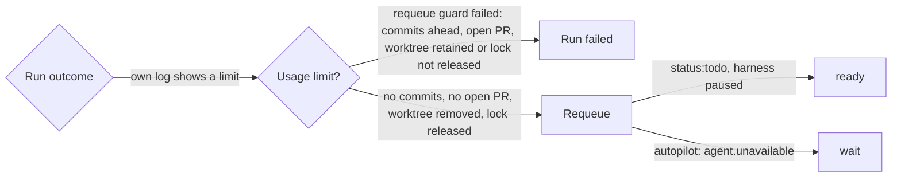

Code references:

- [src/tasks/lifecycle.ts](../src/tasks/lifecycle.ts) — `deriveTaskState`
- [src/tasks/runner.ts](../src/tasks/runner.ts) — `processNext`
- [src/adapters/usage-limit.ts](../src/adapters/usage-limit.ts) — `detectUsageLimit`
- [src/tasks/runner.ts](../src/tasks/runner.ts) — `requeueClaim`
- [src/tasks/steps.ts](../src/tasks/steps.ts) — `decideStep`

Scenarios:

- **Usage limit: requeue and cooldown** (`usage-limit-requeue`): Only this run's appended error events can trigger cooldown and safe requeue.
- **Autopilot waits out a usage limit** (`usage-limit-wait`): Cooldown is separate from lifecycle: only safe cleanup permits requeue, and the coordinator waits for availability.
- **Usage limit with retained work** (`usage-limit-retained`): Cooldown is separate from lifecycle: only safe cleanup permits requeue, and the coordinator waits for availability.

## Self-review fallback

When every other harness is paused, the author's fresh session may review under cross-or-self.

Design: [ADR-0008](adr/0008-self-review-fallback.md)

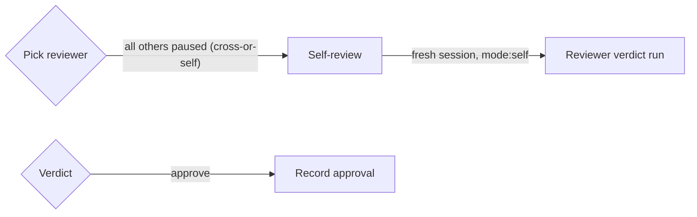

Code references:

- [src/board/reviewer.ts](../src/board/reviewer.ts) — `pickReviewer`
- [src/board/review-run.ts](../src/board/review-run.ts) — `runAutomatedReview`
- [src/board/review-run.ts](../src/board/review-run.ts) — `parseVerdict`
- [src/board/review.ts](../src/board/review.ts) — `approve`

Scenarios:

- **Self-review policy: cross-or-self** (`self-review-cross-or-self`): The other harness is paused; only cross-or-self permits a fresh author review.
- **Self-review policy: cross** (`self-review-cross`): The other harness is paused; only cross-or-self permits a fresh author review.

## Failure recovery

Failed and empty runs clean up safely and keep anything unproven.

Design: [ADR-0006](adr/0006-recoverable-task-lifecycle.md)

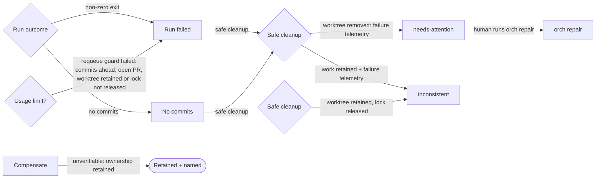

Code references:

- [src/tasks/service.ts](../src/tasks/service.ts) — `claimSpecific`
- [src/tasks/runner.ts](../src/tasks/runner.ts) — `processNext`
- [src/git/worktree.ts](../src/git/worktree.ts) — `worktreeRemovalSafety`
- [src/adapters/usage-limit.ts](../src/adapters/usage-limit.ts) — `detectUsageLimit`
- [src/tasks/lifecycle.ts](../src/tasks/lifecycle.ts) — `deriveTaskState`
- [src/tasks/reconcile.ts](../src/tasks/reconcile.ts) — `reconcileIssue`
- [src/tasks/lifecycle.ts](../src/tasks/lifecycle.ts) — `decideTaskTransition`

Scenarios:

- **Run: failed** (`run-failed`): Failed and empty runs clean up safely; retained work keeps ownership and requires reconciliation.
- **Run: timeout** (`run-timeout`): Failed and empty runs clean up safely; retained work keeps ownership and requires reconciliation.
- **Run: no-commits** (`run-no-commits`): Failed and empty runs clean up safely; retained work keeps ownership and requires reconciliation.
- **Run: failed, work retained** (`run-failed-retained`): Failed and empty runs clean up safely; retained work keeps ownership and requires reconciliation.
- **Ambiguous claim write: compensate** (`claim-compensation`): Re-observe ambiguous writes; compensate only the saga's own delta and owner token.
- **Ambiguous claim rolls forward** (`claim-roll-forward`): Claim setup re-observes durable facts before compensating or accepting an ambiguous write.
- **Claim compensation preserves ownership** (`claim-retain`): Claim setup re-observes durable facts before compensating or accepting an ambiguous write.
- **Merge retains untracked work** (`merge-worktree-retained`): A successful merge releases the lock, but safe cleanup preserves untracked files.
- **Autopilot waits out a usage limit** (`usage-limit-wait`): Cooldown is separate from lifecycle: only safe cleanup permits requeue, and the coordinator waits for availability.
- **Usage limit with retained work** (`usage-limit-retained`): Cooldown is separate from lifecycle: only safe cleanup permits requeue, and the coordinator waits for availability.
- **Repair projects in-review** (`repair-project-in-review`): Repair projects observed lifecycle facts; preserving work or a closed PR can leave human recovery necessary.
- **Repair projects inconsistent** (`repair-project-inconsistent`): Repair projects observed lifecycle facts; preserving work or a closed PR can leave human recovery necessary.
- **Repair projects needs-attention** (`repair-project-needs-attention`): Repair projects observed lifecycle facts; preserving work or a closed PR can leave human recovery necessary.

## Repair

Observe facts, derive state and apply one idempotent action at a time.

Design: [ADR-0006](adr/0006-recoverable-task-lifecycle.md)

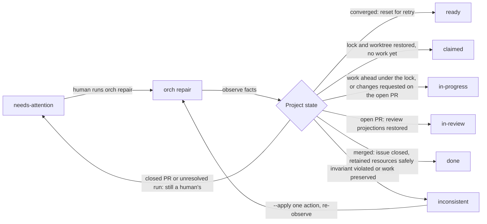

Code references:

- [src/tasks/lifecycle.ts](../src/tasks/lifecycle.ts) — `deriveTaskState`
- [src/tasks/reconcile.ts](../src/tasks/reconcile.ts) — `reconcileIssue`
- [src/tasks/reconcile.ts](../src/tasks/reconcile.ts) — `planRepairs`
- [src/tasks/lifecycle.ts](../src/tasks/lifecycle.ts) — `decideTaskTransition`

Scenarios:

- **Repair converges to ready** (`repair-ready`): Preview is read-only; apply executes one action then re-observes, until the planner returns no actions.
- **Repair converges to claimed** (`repair-claimed`): Preview is read-only; apply executes one action then re-observes, until the planner returns no actions.
- **Repair converges to in-progress** (`repair-in-progress`): Preview is read-only; apply executes one action then re-observes, until the planner returns no actions.
- **Repair converges to done** (`repair-done`): Preview is read-only; apply executes one action then re-observes, until the planner returns no actions.
- **Repair projects in-review** (`repair-project-in-review`): Repair projects observed lifecycle facts; preserving work or a closed PR can leave human recovery necessary.
- **Repair projects inconsistent** (`repair-project-inconsistent`): Repair projects observed lifecycle facts; preserving work or a closed PR can leave human recovery necessary.
- **Repair projects needs-attention** (`repair-project-needs-attention`): Repair projects observed lifecycle facts; preserving work or a closed PR can leave human recovery necessary.

## Abandon

Safe removal by default; --discard is the only forced path.

Design: [ADR-0006](adr/0006-recoverable-task-lifecycle.md)

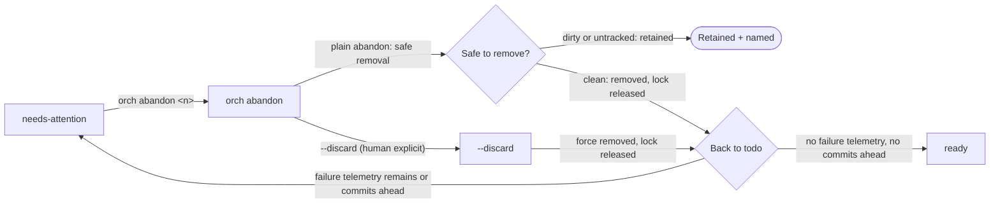

Code references:

- [src/tasks/lifecycle.ts](../src/tasks/lifecycle.ts) — `deriveTaskState`
- [src/commands/abandon.ts](../src/commands/abandon.ts) — `abandonCommand`
- [src/git/worktree.ts](../src/git/worktree.ts) — `worktreeRemovalSafety`

Scenarios:

- **Abandon: clean** (`abandon-clean`): Abandon changes labels and resources; failure telemetry and task branches survive.
- **Abandon: retained** (`abandon-retained`): Abandon changes labels and resources; failure telemetry and task branches survive.
- **Abandon: discard** (`abandon-discard`): Abandon changes labels and resources; failure telemetry and task branches survive.
- **Abandon returns an unused claim to ready** (`abandon-ready`): A safely removed claim with no commits or unresolved failure is ready to claim again.

## Dependency cycles

Cycles in Depends-on are reported, never auto-broken.

Design: [ADR-0009](adr/0009-autonomous-task-loop.md)

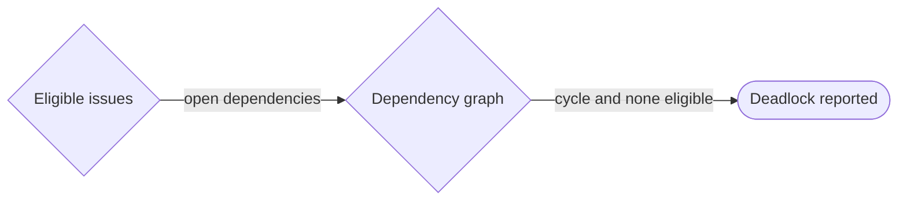

Code references:

- [src/board/board.ts](../src/board/board.ts) — `eligibleIssues`
- [src/board/graph.ts](../src/board/graph.ts) — `buildGraph`
- [src/commands/cycle-report.ts](../src/commands/cycle-report.ts) — `reportCycles`

Scenarios:

- **Dependency cycle: report only** (`dependency-deadlock`): Both tasks block each other; the cycle is reported without changing either body.

## Advisory ordering

After: prefers an order among eligible tasks without ever blocking.

Design: No dedicated ADR in the model.

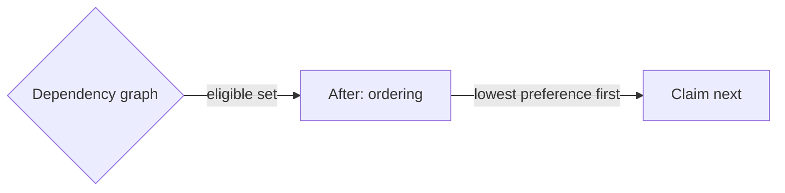

Code references:

- [src/board/graph.ts](../src/board/graph.ts) — `buildGraph`
- [src/board/board.ts](../src/board/board.ts) — `orderByAfter`
- [src/tasks/service.ts](../src/tasks/service.ts) — `claimNext`

Scenarios:

- **Claim, run, review, merge** (`happy-path`): One routed task flows from todo to done under the real deciders.
- **After preferences vs hard dependencies** (`after-eligible`): Order eligible candidates only: After never blocks on an unavailable predecessor, Depends-on does.
- **After preferences vs hard dependencies** (`after-unavailable`): Order eligible candidates only: After never blocks on an unavailable predecessor, Depends-on does.

## Run report

The loop measures itself and reports at the end of a run.

Design: [ADR-0009](adr/0009-autonomous-task-loop.md)

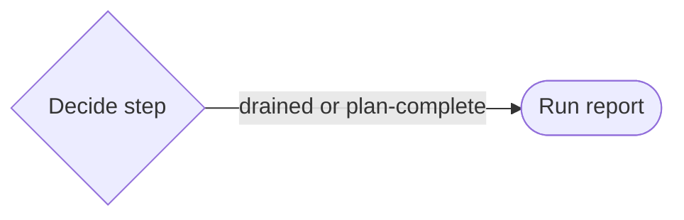

Code references:

- [src/tasks/steps.ts](../src/tasks/steps.ts) — `decideStep`
- [src/board/report.ts](../src/board/report.ts) — `buildRunReport`

Scenarios:

- **Autopilot concludes the plan is complete** (`plan-complete`): With no scoped issue open outside needs-attention, the scoped autopilot stops plan-complete and reports.
