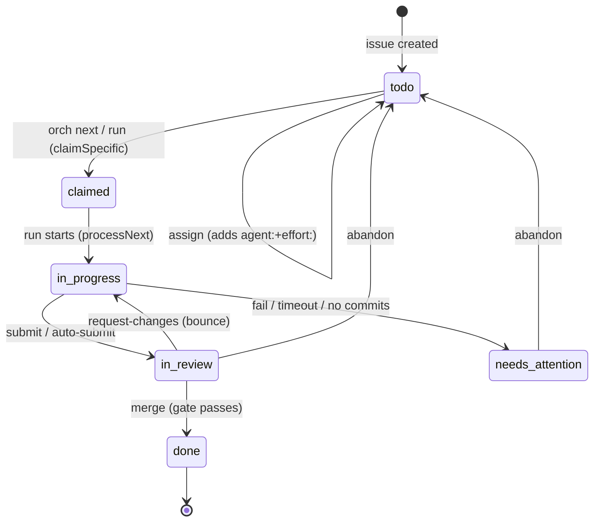

# WORKFLOW — labels & issue lifecycle

The single reference for **every label orch relies on** and **exactly when each is set
or cleared**. Traced from source (`src/github/labels.ts`, `src/tasks/service.ts`,
`src/tasks/runner.ts`, `src/board/review.ts`, `src/board/board.ts`,
`src/commands/abandon.ts`) — if code and this table disagree, the
code wins and this file is the bug. Vocabulary lives in `CONTEXT.md`.

All labels are created by `orch init` from the canonical set in `src/github/labels.ts`.

## Label catalogue

| Label | Color | Meaning | Set by | Cleared by |
|---|---|---|---|---|
| `status:todo` | `ededed` | Ready to be claimed (the implicit default when no `status:*` present) | `orch init`; `abandon` (reset) | `claimSpecific` |
| `status:claimed` | `fbca04` | Lock held, worktree being set up | `claimSpecific` | `processNext` start; `submit`; `abandon` |
| `status:in-progress` | `0e8a16` | Harness is running | `processNext` start; `requestChanges` (bounce back) | `submit`; no-commits path; `abandon` |
| `status:in-review` | `1d76db` | PR open, awaiting cross-review | `submit` | `requestChanges`; `merge`; `abandon` |
| `status:done` | `5319e7` | Merged | `merge` | — (terminal) |
| `status:blocked` | `b60205` | **⚠ Defined but never applied** — see note below | *(nothing)* | *(nothing)* |
| `agent:claude` / `agent:codex` | purple/blue | Owner — which harness runs it | `assign`; `claimSpecific` | `abandon` only (**sticky**) |
| `effort:easy` | `c2e0c6` | Use the agent's *easy* model tier | `assign` | — (**sticky**; no path removes it) |
| `effort:hard` | `f9d0c4` | Use the agent's *hard* model tier | `assign` | — (**sticky**) |
| `review:needed` | `e99695` | Awaiting review by the *other* harness | `submit` | `approve`; `requestChanges` |
| `reviewed-by:claude` / `reviewed-by:codex` | `c5def5` | Cross-review approval recorded | `approve` | — (terminal) |
| `needs-attention` | `d93f0b` | Run failed / produced nothing — a human must look | `processNext` (fail, timeout, no-commits) | `abandon` |
| `assigned-by:brain` | `bfd4f2` | Provenance: this routing came from the judge, not a human | `assign --auto` / `POST /actions/assign` (origin brain) | *(future re-route pass)* |

**Sticky** = set once at routing/claim time and honored on every future run; only
`abandon` clears `agent:`, and *nothing* clears `effort:`. Re-routing an issue to a
different agent/effort today means `abandon` then re-`assign`.

## Lifecycle (happy path)

## Transition ledger (who writes what)

Each row is one atomic `editIssue`. `+` = add label, `−` = remove label.

| Event | Fn | `+` | `−` | Side effects |
|---|---|---|---|---|
| Route (human) | `assign --apply` | `agent:X`, `effort:Y` | — | fill-blanks-only; skips already-pinned |
| Route (judge) | `assign --auto` / `/actions/assign` | `agent:X`, `effort:Y`, `assigned-by:brain` | — | judge-authored; same fill-blanks-only writer |
| Claim | `claimSpecific` | `status:claimed`, `agent:X` | `status:todo` | acquire lock, assign `@me`, cut worktree |
| Run start | `processNext` | `status:in-progress` | `status:claimed` | spawn harness at resolved model |
| Submit | `submit` | `status:in-review`, `review:needed` | `status:claimed`, `status:in-progress` | push branch, open PR (`Closes #n`) |
| Run fails / times out | `processNext` | `needs-attention` | *(none — see wrinkle)* | release lock, prune worktree |
| Run, no commits | `processNext` | `needs-attention` | `status:in-progress` | release lock, prune worktree |
| Approve | `approve` | `reviewed-by:X` | `review:needed` | `gh pr review --approve` |
| Request changes | `requestChanges` | `status:in-progress` | `review:needed`, `status:in-review` | `gh pr review --request-changes` |
| Merge | `merge` | `status:done` | `status:in-review` | gate check, squash-merge, prune worktree, release lock |
| Abandon | `abandon` | `status:todo` | `status:claimed`, `status:in-progress`, `status:in-review`, `needs-attention`, `agent:X` | release lock, prune worktree |

## Known wrinkles (documented, not yet fixed)

1. **`status:blocked` is vestigial.** It exists in the label set and has a color, but
   **no code path ever applies or removes it.** "Blocked" is computed on read from
   `Depends-on:` lines (`isEligible` → `openDepsFromMap`): a blocked issue simply stays
   `status:todo` and is filtered out of `eligibleIssues`. The snapshot/dashboard may
   *display* blocked-ness, but the label is not the source of that truth. Either wire it
   up or drop it — tracked as a hardening candidate.

2. **A failed run leaves `status:in-progress` on.** The fail/timeout path adds
   `needs-attention` but does **not** remove `status:in-progress`, so a failed issue
   reads as `in-progress + needs-attention` — while the *no-commits* path on the same
   function removes `in-progress`. Inconsistent; the lock is released either way so the
   issue is still re-claimable. Harden by making both paths reset status uniformly.

3. **`effort:` is never cleared.** Once routed, an issue keeps its effort tier forever
   unless a human edits it. Intentional (sticky routing), but means re-routing effort
   requires a manual label edit or `abandon`.

## Where routing labels get honored

- `effort:` → `resolveTaskModel(agent, issue, cfg)` at spawn → `RunContext.model` →
  adapter appends the model flag. No label ⇒ `cfg.defaultEffort` (`hard`).
- `agent:` → `claimNext` skips issues pinned to a different agent.
- `review:needed` + `reviewed-by:` → the merge `gate` (`evaluateGate`).
