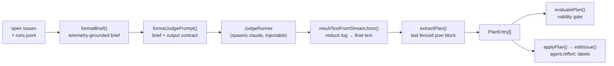

# The routing judge

`orch` decides *which* agent builds *which* issue at *what* effort with an
**LLM-as-judge**. This is the one place the system hands a decision to a model, so
it is built as a reliability problem first and a prompt second: a fixed output
contract, an injectable spawn boundary, fail-closed parsing, and an explicit
evaluation story.

Everything below is in `src/routing/judge.ts` (the judge), `src/routing/assign.ts` (the brief and
the writer), and `src/routing/judge-eval.ts` (the evaluator).

## The pipeline



Two things never touch a model and are pure functions, which is what makes the
judge testable end-to-end without spending a token: **`formatBrief` /
`formatJudgePrompt`** on the way in, and **`extractPlan` / `evaluatePlan`** on the
way out. The only impure step, the model call, sits behind the `JudgeRunner` type
so tests inject a canned reply (`test/judge.test.ts`) and the `--demo` fixture
injects a fixed plan (`src/server/demo.ts`).

## The prompt is a contract

`formatJudgePrompt(brief)` wraps the routing brief with an output contract that is
embedded **verbatim** in the prompt (`CONTRACT` in `src/routing/judge.ts`):

- Reply with **exactly one** fenced ` ```json ` block and nothing after it.
- **One array element per unassigned issue — skip nothing.** (Completeness is part
  of the contract, and is checked downstream; see Evaluation.)
- `agent` must be one of the agents shown in the telemetry section; `effort` must
  be `"easy"` or `"hard"`.
- Choose the agent from the **per-agent telemetry** — prefer better success
  rate / cost for that effort tier, break ties toward load balancing.
- `rationale`: one sentence grounded in the brief (the scope and the telemetry it
  used).

The brief the contract refers to (`formatBrief`) is deterministic: for each
unassigned issue it lists scope, `Depends-on`, and a files hint, then a telemetry
block per agent (runs, success rate, median tokens/cost/duration, last three
runs). The judge is told to ground its choice in that block — routing is a
data-informed decision, not a vibe.

## Effort is agent-neutral

The judge emits an **abstract tier** — `easy` or `hard` — never a model name. Each
adapter maps the tier to its own concept at spawn time (`claude` → `sonnet`/`opus`,
`codex` → reasoning-effort `low`/`high`; see `orch.config.json`). This keeps the
judge's vocabulary stable as models churn and lets a heterogeneous fleet share one
routing decision. The judge process itself runs at the **lead's `hard` tier**
(`runJudge` resolves `cfg.adapters[cfg.lead].models.hard`) — routing is the kind of
ambiguous, cross-cutting call the strong tier exists for.

## Fail-closed by construction

`runJudge` throws — writing nothing — on every failure mode, so a bad run can never
half-route the board:

| Condition | Result |
|---|---|
| non-zero exit | throw (raw output truncated into the message) |
| timeout (`taskTimeoutMs`) | throw |
| no fenced json block / invalid JSON / not an array / entry lacks integer `issue` | `extractPlan` throws → "not parseable" |
| empty plan `[]` | throw |

`extractPlan` reads the **last** fenced block (json-tagged preferred), tolerating
leading prose and "on reflection…" second thoughts, and validates *structure*
only. It deliberately does **not** validate `agent`/`effort` values — the writer's
`applyPlan` reports those as non-fatal skips, and the evaluator flags them — so
parsing stays about shape and policy stays in one place.

## Evaluation

Parsing being safe is not the same as the routing being good, so the judge has an
explicit evaluation story (full rationale in
[ADR-0005](adr/0005-judge-evaluation.md)):

- **Validity — measured, in CI.** `evaluatePlan(plan, issues, cfg)` returns every
  contract violation: `coverage-missing`, `coverage-extra`, `duplicate`,
  `invalid-agent`, `invalid-effort`, `missing-rationale`. It is pure and runs over
  golden fixtures (`test/judge-eval.test.ts`). Crucially it catches the two
  failures the writer is blind to — an issue the judge **forgot**, and a **blank
  rationale** — and those two are also surfaced as warnings on the live
  `orch assign --judge/--auto` path.
- **Live validity — opt-in.** The same gate runs against the *real* model behind
  `ORCH_JUDGE_LIVE=1 npm test`, skipped by default so CI stays hermetic.
- **Quality — designed, not faked.** Whether a route is *good* needs ground truth:
  an offline replay of `runs.jsonl` asking "did the routed agent actually finish,
  cheaper than the alternative?" That is a data problem, documented as the roadmap
  rather than stubbed with a meaningless score.

## Where it runs

- `orch assign --judge` — print the plan the judge proposes (JSON on stdout;
  completeness warnings on stderr).
- `orch assign --auto` — run the judge and apply its plan (stamps
  `assigned-by:brain`).
- Dashboard `POST /actions/suggest` — the same `runJudge` in-process, returning the
  same `PlanEntry[]` for the browser's Suggest → edit → Apply loop (ADR-0004).

See it with no setup: `orch serve --demo`, then the walkthrough in
[demo.md](../demo.md).
